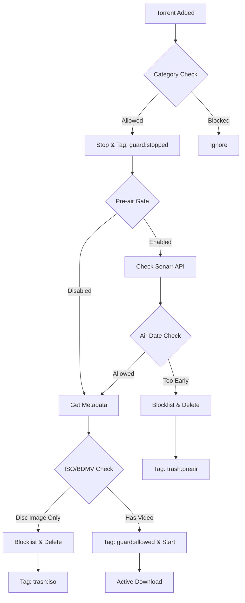

# qbit-guard

A zero-dependency Python guard for qBittorrent that provides intelligent torrent management with **pre-air checking** and **ISO/BDMV cleanup**.

<div class="grid cards" markdown>

-   :material-download:{ .lg .middle } __Get Started__

    ---

    Install and configure qbit-guard in minutes

    [:octicons-arrow-right-24: Installation](usage/install.md)

-   :material-cog:{ .lg .middle } __Configuration__

    ---

    Environment-driven configuration with sensible defaults

    [:octicons-arrow-right-24: Configuration](usage/configure.md)

-   :material-code-braces:{ .lg .middle } __Examples__

    ---

    Real-world deployment scenarios and configurations

    [:octicons-arrow-right-24: Examples](examples.md)

-   :material-help-circle:{ .lg .middle } __Support__

    ---

    Troubleshooting guide and development resources

    [:octicons-arrow-right-24: Troubleshooting](troubleshooting.md)

</div>

## :sparkles: Features

!!! tip "Intelligent Torrent Management"
    qbit-guard automatically manages your torrents with smart filtering and cleanup rules.

=== "Pre-air Gate"

    **Stops new TV torrents and validates air dates**
    
    - Checks `airDateUtc` with configurable grace/cap windows
    - Supports release group / indexer / tracker whitelisting
    - Blocks too-early releases automatically
    - Integrates with Sonarr for metadata validation

=== "ISO/BDMV Cleanup"

    **Removes disc-image-only torrents**
    
    - Detects ISO/IMG/MDF/NRG/CUE/BIN files
    - Identifies `BDMV` and `VIDEO_TS` folders
    - Preserves torrents with keepable video files
    - Configurable minimum file size thresholds

=== "Smart Blocklisting"

    **Automated blocklist management**
    
    - Blocklists in Sonarr/Radarr before deletion
    - Uses deduped history (single "grabbed" record per unique release)
    - Queue failover if history endpoint times out
    - Prevents duplicate downloads

=== "Cross-verification"

    **Optional internet verification**
    
    - TVmaze and/or TheTVDB integration
    - Cross-checks Sonarr air dates
    - Improves accuracy of pre-air filtering
    - No API keys required for TVmaze

=== "qBittorrent Support"

    **Works with modern and legacy versions**
    
    - **qBittorrent 5.x** - Preferred with start/stop support
    - **qBittorrent 4.x** - Uses resume/pause fallback
    - WebUI authentication support
    - Category-based filtering

=== "Zero Dependencies"

    **Container-friendly and lightweight**
    
    - Pure Python 3.8+ standard library
    - Environment variable configuration
    - Structured JSON logging to stdout
    - Minimal resource usage

---

## :gear: How it Works



!!! info "Flow Steps"
    1. **On add** → torrent immediately stopped and tagged `guard:stopped`
    2. **Category filter** → only `QBIT_ALLOWED_CATEGORIES` are processed  
    3. **Pre-air gate** (if Sonarr category): consult Sonarr (+ optional TVmaze/TVDB)
        - If **blocked** → blocklist in *arr, tag `trash:preair`, delete torrent
        - If **allowed** → continue
    4. **Metadata fetch** → briefly start torrent to get file list, respect wait/budget limits, then stop
    5. **ISO/BDMV cleanup** → if disc-image-only and no keepable video, blocklist + delete (tag `trash:iso`)
    6. **Start for real** → tag `guard:allowed` and start torrent

!!! note "Keepable Video Files"
    Files with extensions: `.mkv .mp4 .m4v .avi .ts .m2ts .mov .webm` and size ≥ threshold.

---

## :hammer_and_wrench: Requirements

!!! warning "Prerequisites"
    Ensure all services are properly networked and accessible between containers.

| Component | Version | Purpose | Required |
|-----------|---------|---------|----------|
| **qBittorrent** | 5.x (4.x supported) | Torrent client | :material-check: Required |
| **Python** | 3.8+ | Script mode only | :material-minus: Optional |
| **Sonarr** | v3+ | Pre-air checking | :material-minus: Optional |
| **Radarr** | v3+ | Pre-air checking | :material-minus: Optional |
| **Network** | - | Service connectivity | :material-check: Required |

---

## :rocket: Quick Start

=== "Docker Compose (Recommended)"

    ```yaml
    version: '3.8'
    services:
      qbit-guard:
        image: ghcr.io/gengines/qbit-guard:latest
        container_name: qbit-guard
        restart: unless-stopped
        environment:
          - QBIT_HOST=http://qbittorrent:8080
          - QBIT_USER=admin
          - QBIT_PASS=your_password
          - QBIT_ALLOWED_CATEGORIES=tv-sonarr,radarr
          - ENABLE_PREAIR_CHECK=1
          - SONARR_URL=http://sonarr:8989
          - SONARR_APIKEY=your_api_key
          - ENABLE_ISO_CHECK=1
          - LOG_LEVEL=INFO
        networks: [arr-network]

    networks:
      arr-network: { driver: bridge }
    ```

=== "Docker Run"

    ```bash
    docker run -d \
      --name qbit-guard \
      --restart unless-stopped \
      --network arr-network \
      -e QBIT_HOST=http://qbittorrent:8080 \
      -e QBIT_USER=admin \
      -e QBIT_PASS=your_password \
      -e QBIT_ALLOWED_CATEGORIES=tv-sonarr,radarr \
      -e ENABLE_PREAIR_CHECK=1 \
      -e SONARR_URL=http://sonarr:8989 \
      -e SONARR_APIKEY=your_api_key \
      -e ENABLE_ISO_CHECK=1 \
      -e LOG_LEVEL=INFO \
      ghcr.io/gengines/qbit-guard:latest
    ```

=== "Python Script"

    ```bash
    # Download the script
    wget https://github.com/GEngines/qbit-guard/raw/main/src/qbit_guard.py
    
    # Set environment variables
    export QBIT_HOST=http://localhost:8080
    export QBIT_USER=admin
    export QBIT_PASS=your_password
    export QBIT_ALLOWED_CATEGORIES=tv-sonarr,radarr
    export ENABLE_PREAIR_CHECK=1
    export SONARR_URL=http://localhost:8989
    export SONARR_APIKEY=your_api_key
    
    # Run the script
    python3 qbit_guard.py
    ```

!!! tip "Next Steps"
    After starting qbit-guard, check the logs to ensure it connects successfully to qBittorrent and any configured *arr services.

---

## :books: Documentation

- **[Installation Guide](usage/install.md)** - Detailed setup instructions
- **[Configuration Guide](usage/configure.md)** - Complete configuration options  
- **[Environment Variables](usage/env.md)** - Full variable reference
- **[Examples](examples.md)** - Real-world deployment scenarios
- **[Development](usage/dev.md)** - Development and contribution guide
- **[Troubleshooting](troubleshooting.md)** - Common issues and solutions